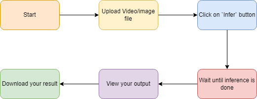
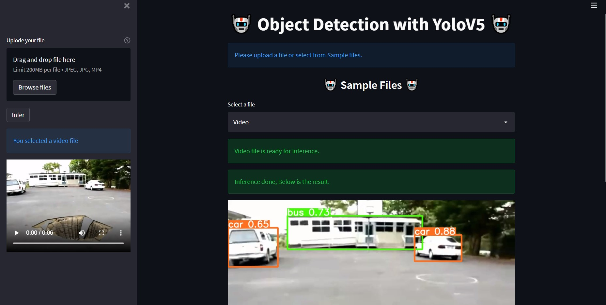

<p align="center">

</p>


<h2 align="center">
 🤖 Object Detection with YoloV5 🤖 
 </h2>

<p align="center">

</p>

Used state-of-the-art object detection model YoloV5   trained on [COCO 80 classes](https://github.com/ultralytics/yolov5/blob/master/data/coco.yaml), weights are downloaded. 

Used [streamlit](https://streamlit.io/) for the webpage

### To run the program on the local machine, follow below steps.
``` 1. Clone the repository ```

``` 2. Create an virtual env (python>=3.8)```

``` 3. pip install -r requirements.txt``` 

``` 4. streamlit run st.py ```

``` Application should open on your default browser```


You can upload an image or video file, the app will understand and will show you a message about your file type and inference will proceed as per your file type. Click on the `infer` button to start the inference. The inference will take time as per your file size and system configuration.
one sample image and video are provided contained in the `samples_inputs` folder, although it can perform detection from any video or image that is uploaded.
After the completion of the inference output will appear along with a download link for the file.


<p align="center">

</p>

### Test Video
<iframe width="1124" height="632" src="https://www.youtube.com/embed/lLWXCNhjrUA" title="YouTube video player" frameborder="0" allow="accelerometer; autoplay; clipboard-write; encrypted-media; gyroscope; picture-in-picture" allowfullscreen></iframe>


### Contributor  

[Subhabrata Nath](https://www.linkedin.com/in/subhabrata-nath-181375115/)

## Acknowledge 
[yolov5 ultralytics](https://github.com/ultralytics/yolov5) 
